# Syndactyl Architecture Diagrams

## Software Architecture

This diagram shows the internal component structure of a single Syndactyl node.


## Component Interaction Flow

This diagram shows how a file change propagates through the system.


## Data Flow Architecture

This diagram shows how data flows through different layers.


## Thread Architecture

This diagram shows the threading model.

```mermaid
graph TB
    subgraph "Main Thread (Tokio Runtime)"
        MainAsync[Main Async Context]
        NetMgr[Network Manager Event Loop]
    end
    
    subgraph "Observer Threads (OS Threads)"
        Obs1[Observer Thread 1<br/>std::thread]
        Obs2[Observer Thread 2<br/>std::thread]
        ObsN[Observer Thread N<br/>std::thread]
    end
    
    subgraph "Channels"
        StdMpsc[std::mpsc::channel<br/>Observer Events]
        TokioMpsc[tokio::mpsc::channel<br/>P2P Events]
        Bridge[Bridge Thread<br/>std::mpsc → tokio::mpsc]
    end
    
    Obs1 -->|Send Events| StdMpsc
    Obs2 -->|Send Events| StdMpsc
    ObsN -->|Send Events| StdMpsc
    
    StdMpsc --> Bridge
    Bridge --> TokioMpsc
    
    TokioMpsc --> NetMgr
    
    MainAsync -.->|Spawns| Obs1
    MainAsync -.->|Spawns| Obs2
    MainAsync -.->|Spawns| ObsN
    MainAsync -.->|Spawns| NetMgr
    
    NetMgr -->|tokio::select!| P2PEvents[P2P Events]
    NetMgr -->|tokio::select!| ObsEvents[Observer Events]
    NetMgr -->|tokio::select!| SwarmEvents[Swarm Events]
    
    classDef asyncClass fill:#e1f5ff,stroke:#0277bd,stroke-width:2px
    classDef threadClass fill:#fff9c4,stroke:#f57f17,stroke-width:2px
    classDef channelClass fill:#f3e5f5,stroke:#6a1b9a,stroke-width:2px
    
    class MainAsync,NetMgr,P2PEvents,ObsEvents,SwarmEvents asyncClass
    class Obs1,Obs2,ObsN,Bridge threadClass
    class StdMpsc,TokioMpsc channelClass
```



---

## Viewing These Diagrams

These diagrams use Mermaid.js syntax and can be viewed in:

1. **GitHub** - Natively renders Mermaid in markdown files
2. **GitLab** - Natively supports Mermaid
3. **VS Code** - Install "Markdown Preview Mermaid Support" extension
4. **Online** - [Mermaid Live Editor](https://mermaid.live/)
5. **Obsidian** - Natively supports Mermaid
6. **Notion** - Via Mermaid blocks

### Rendering Locally

If you have Node.js installed, you can render to SVG/PNG:

```bash
npm install -g @mermaid-js/mermaid-cli
mmdc -i architecture-diagram.md -o architecture-diagram.svg
```
