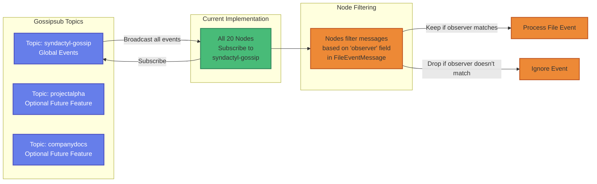
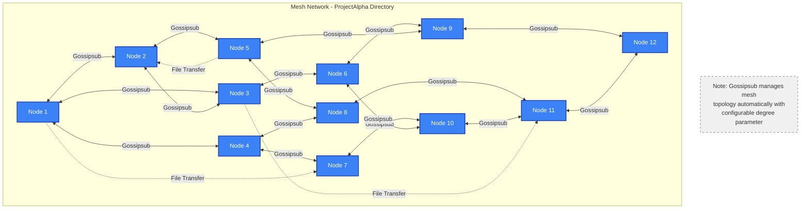
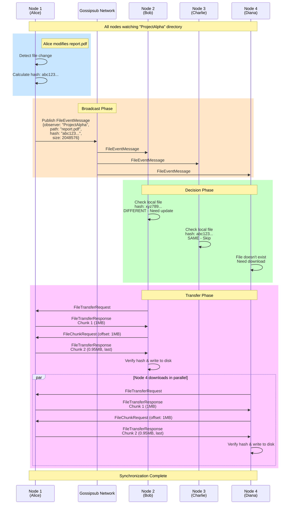
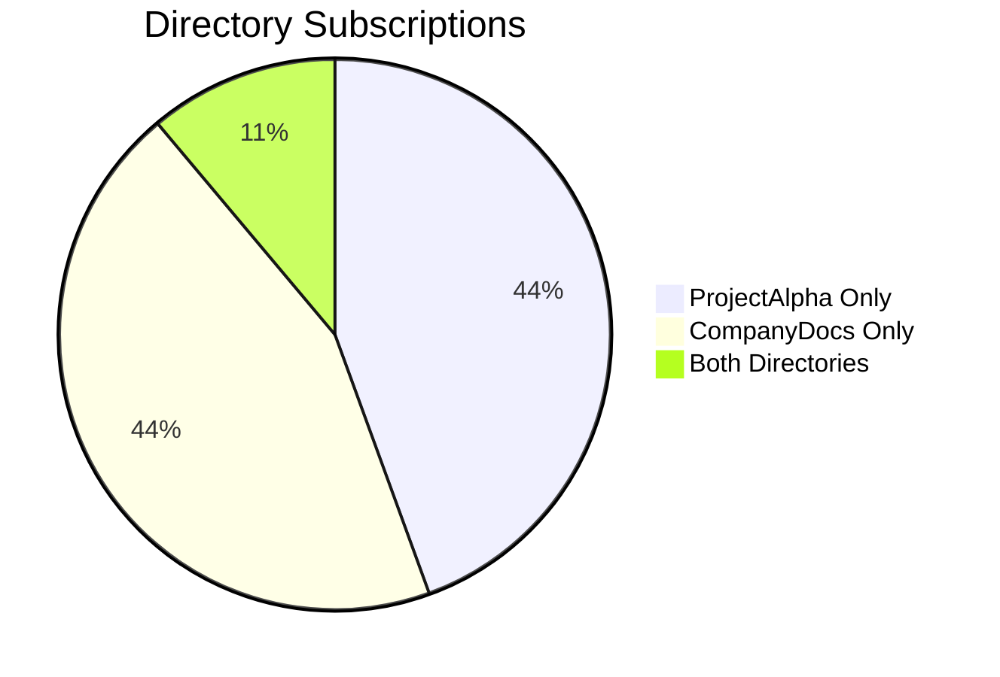
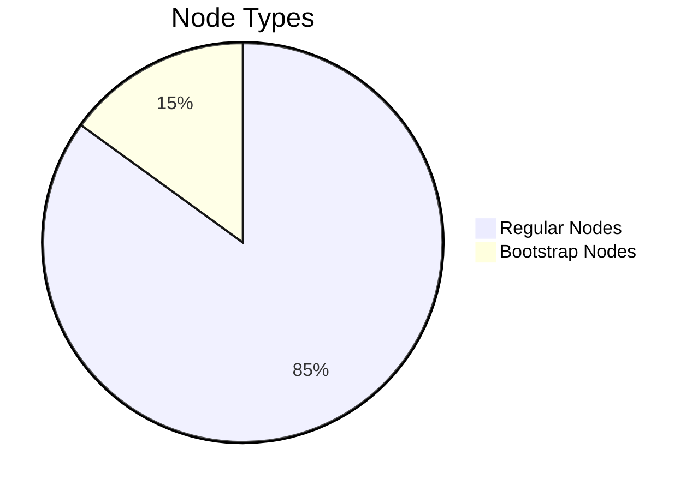
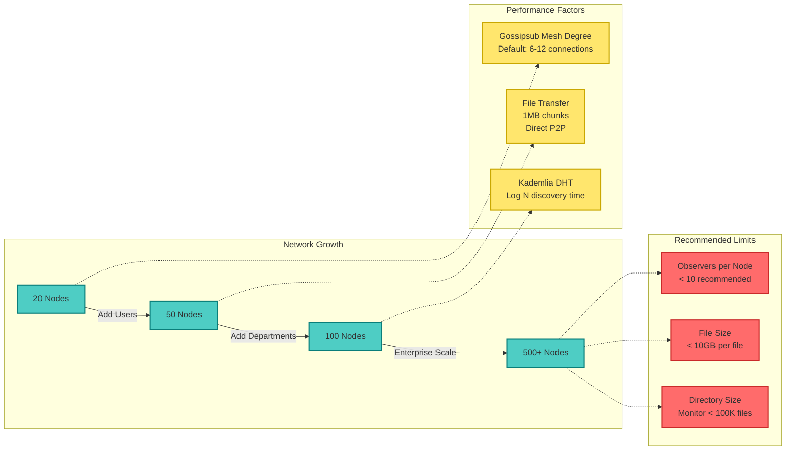

# Syndactyl Network Topology Examples

## Example Network: 20 Nodes with 2 Shared Directories

This example shows a realistic deployment with 20 systems sharing two different directories ("ProjectAlpha" and "CompanyDocs").

### Network Overview

```mermaid
graph TB
    subgraph "Bootstrap Nodes"
        B1[Bootstrap Node 1<br/>Alice's Desktop<br/>IP: 192.168.1.10]
        B2[Bootstrap Node 2<br/>Bob's Server<br/>IP: 192.168.1.20]
    end
    
    subgraph "ProjectAlpha Subscribers (12 nodes)"
        PA1[Charlie<br/>Desktop]
        PA2[Diana<br/>Laptop]
        PA3[Eve<br/>Server]
        PA4[Frank<br/>Workstation]
        PA5[Grace<br/>Laptop]
        PA6[Heidi<br/>Desktop]
        PA7[Ivan<br/>Laptop]
        PA8[Judy<br/>Workstation]
        PA9[Mallory<br/>Desktop]
        PA10[Niaj<br/>Laptop]
        PA11[Oscar<br/>Server]
        PA12[Peggy<br/>Desktop]
    end
    
    subgraph "CompanyDocs Subscribers (15 nodes)"
        CD1[Alice<br/>Desktop]
        CD2[Bob<br/>Server]
        CD3[Carol<br/>Laptop]
        CD4[Dave<br/>Desktop]
        CD5[Ellen<br/>Laptop]
        CD6[Fred<br/>Workstation]
        CD7[Gina<br/>Desktop]
        CD8[Henry<br/>Laptop]
        CD9[Iris<br/>Desktop]
        CD10[Jack<br/>Server]
        CD11[Kate<br/>Laptop]
        CD12[Leo<br/>Desktop]
        CD13[Mia<br/>Laptop]
        CD14[Nick<br/>Workstation]
        CD15[Olivia<br/>Desktop]
    end
    
    subgraph "Both Directories (3 nodes)"
        BOTH1[Alice - Desktop<br/>Both Directories]
        BOTH2[Bob - Server<br/>Both Directories]
        BOTH3[Charlie - Desktop<br/>Both Directories]
    end
    
    %% Bootstrap connections
    B1 <-.->|Kademlia DHT| B2
    
    %% All nodes connect to bootstrap for discovery
    PA1 & PA2 & PA3 & PA4 & PA5 & PA6 -.->|Initial Discovery| B1
    PA7 & PA8 & PA9 & PA10 & PA11 & PA12 -.->|Initial Discovery| B2
    
    CD1 & CD2 & CD3 & CD4 & CD5 -.->|Initial Discovery| B1
    CD6 & CD7 & CD8 & CD9 & CD10 -.->|Initial Discovery| B2
    CD11 & CD12 & CD13 & CD14 & CD15 -.->|Initial Discovery| B1
    
    %% Note about topology
    Note1[Note: After initial discovery,<br/>nodes form mesh connections<br/>directly with each other]
    
    classDef bootstrap fill:#ff6b6b,stroke:#c92a2a,stroke-width:3px,color:#fff
    classDef projectAlpha fill:#4ecdc4,stroke:#0a7e7a,stroke-width:2px
    classDef companyDocs fill:#ffe66d,stroke:#c9a700,stroke-width:2px
    classDef both fill:#a8e6cf,stroke:#3d8361,stroke-width:3px
    classDef note fill:#f0f0f0,stroke:#666,stroke-width:1px,stroke-dasharray: 5 5
    
    class B1,B2 bootstrap
    class PA1,PA2,PA3,PA4,PA5,PA6,PA7,PA8,PA9,PA10,PA11,PA12 projectAlpha
    class CD1,CD2,CD3,CD4,CD5,CD6,CD7,CD8,CD9,CD10,CD11,CD12,CD13,CD14,CD15 companyDocs
    class BOTH1,BOTH2,BOTH3 both
    class Note1 note
```



## Gossipsub Topic Topology

This shows how nodes subscribe to different Gossipsub topics based on their directory subscriptions.



## P2P Mesh Network Topology

After initial bootstrap discovery, nodes form direct connections in a mesh topology.



## File Synchronization Flow Example

This shows what happens when a file is modified on one node and synced to others.



## Physical Network Layout Example

```mermaid
graph TB
    subgraph "Office Network - 192.168.1.0/24"
        Router1[Office Router<br/>192.168.1.1]
        Desktop1[Desktop 1<br/>192.168.1.10<br/>Bootstrap Node]
        Desktop2[Desktop 2<br/>192.168.1.11]
        Desktop3[Desktop 3<br/>192.168.1.12]
        Server1[File Server<br/>192.168.1.20<br/>Bootstrap Node]
        Laptop1[Laptop 1<br/>192.168.1.30]
        Laptop2[Laptop 2<br/>192.168.1.31]
    end
    
    subgraph "Remote Office - 10.0.0.0/24"
        Router2[Remote Router<br/>10.0.0.1]
        Desktop4[Desktop 4<br/>10.0.0.10]
        Desktop5[Desktop 5<br/>10.0.0.11]
        Laptop3[Laptop 3<br/>10.0.0.20]
    end
    
    subgraph "Home Workers"
        Home1[Home Desktop<br/>Dynamic IP<br/>NAT Traversal]
        Home2[Home Laptop<br/>Dynamic IP<br/>NAT Traversal]
    end
    
    subgraph "Cloud VPS"
        VPS1[Cloud Server<br/>Public IP<br/>Bootstrap Node]
    end
    
    Internet((Internet))
    
    Router1 <--> Internet
    Router2 <--> Internet
    Home1 <--> Internet
    Home2 <--> Internet
    VPS1 <--> Internet
    
    Desktop1 & Desktop2 & Desktop3 & Server1 & Laptop1 & Laptop2 --> Router1
    Desktop4 & Desktop5 & Laptop3 --> Router2
    
    Note3[Note: Kademlia DHT helps with<br/>NAT traversal and peer discovery<br/>across different networks]
    
    classDef router fill:#ff6b6b,stroke:#c92a2a,stroke-width:2px,color:#fff
    classDef bootstrap fill:#51cf66,stroke:#2f9e44,stroke-width:3px
    classDef office fill:#74c0fc,stroke:#1971c2,stroke-width:2px
    classDef remote fill:#ffd43b,stroke:#f59f00,stroke-width:2px
    classDef home fill:#da77f2,stroke:#9c36b5,stroke-width:2px
    classDef cloud fill:#ff8787,stroke:#e03131,stroke-width:2px
    classDef internet fill:#495057,stroke:#212529,stroke-width:3px,color:#fff
    classDef note fill:#f0f0f0,stroke:#666,stroke-width:1px,stroke-dasharray: 5 5
    
    class Router1,Router2 router
    class Desktop1,Server1,VPS1 bootstrap
    class Desktop2,Desktop3,Laptop1,Laptop2 office
    class Desktop4,Desktop5,Laptop3 remote
    class Home1,Home2 home
    class VPS1 cloud
    class Internet internet
    class Note3 note
```



## Configuration Example for Multi-Directory Setup

Here's how a node would be configured to participate in both directories:

```json
{
  "observers": [
    {
      "name": "ProjectAlpha",
      "path": "/home/user/sync/ProjectAlpha"
    },
    {
      "name": "CompanyDocs",
      "path": "/home/user/sync/CompanyDocs"
    }
  ],
  "network": {
    "listen_addr": "0.0.0.0",
    "port": "49999",
    "dht_mode": "server",
    "bootstrap_peers": [
      {
        "ip": "192.168.1.10",
        "port": "49999",
        "peer_id": "12D3KooWAbc123...BootstrapNode1"
      },
      {
        "ip": "192.168.1.20",
        "port": "49999",
        "peer_id": "12D3KooWDef456...BootstrapNode2"
      },
      {
        "ip": "203.0.113.50",
        "port": "49999",
        "peer_id": "12D3KooWGhi789...CloudBootstrap"
      }
    ]
  }
}
```

## Directory Access Matrix

This table shows which nodes have access to which directories in our example:

| Node | ProjectAlpha | CompanyDocs | Role |
|------|--------------|-------------|------|
| Alice | ✓ | ✓ | Bootstrap |
| Bob | ✓ | ✓ | Bootstrap |
| Charlie | ✓ | ✓ | Regular |
| Diana | ✓ | ✗ | Regular |
| Eve | ✓ | ✗ | Regular |
| Frank | ✓ | ✗ | Regular |
| Grace | ✓ | ✗ | Regular |
| Heidi | ✓ | ✗ | Regular |
| Ivan | ✓ | ✗ | Regular |
| Judy | ✓ | ✗ | Regular |
| Mallory | ✓ | ✗ | Regular |
| Niaj | ✓ | ✗ | Regular |
| Oscar | ✓ | ✗ | Regular |
| Peggy | ✓ | ✗ | Regular |
| Carol | ✗ | ✓ | Regular |
| Dave | ✗ | ✓ | Regular |
| Ellen | ✗ | ✓ | Regular |
| Fred | ✗ | ✓ | Regular |
| Gina | ✗ | ✓ | Regular |
| Henry | ✗ | ✓ | Regular |
| Iris | ✗ | ✓ | Regular |
| Jack | ✗ | ✓ | Regular |

**Total: 20 unique nodes**
- ProjectAlpha subscribers: 15 nodes (12 exclusive + 3 both)
- CompanyDocs subscribers: 15 nodes (12 exclusive + 3 both)
- Bootstrap nodes: 2-3 (should have good uptime)

## Network Statistics for This Setup





## Scalability Considerations



---

## Key Takeaways

1. **Decentralized**: No central server required; any node can go offline without affecting others
2. **Mesh Topology**: Nodes connect directly to each other after bootstrap discovery
3. **Selective Sync**: Nodes only sync directories they're configured for
4. **Efficient Broadcasting**: Gossipsub prevents message duplication and manages mesh connections
5. **Direct Transfers**: Large files are transferred directly peer-to-peer, not broadcasted
6. **Bootstrap Nodes**: Help with initial discovery but aren't required after connections are established
7. **NAT Traversal**: Kademlia DHT helps nodes behind NAT connect to each other
